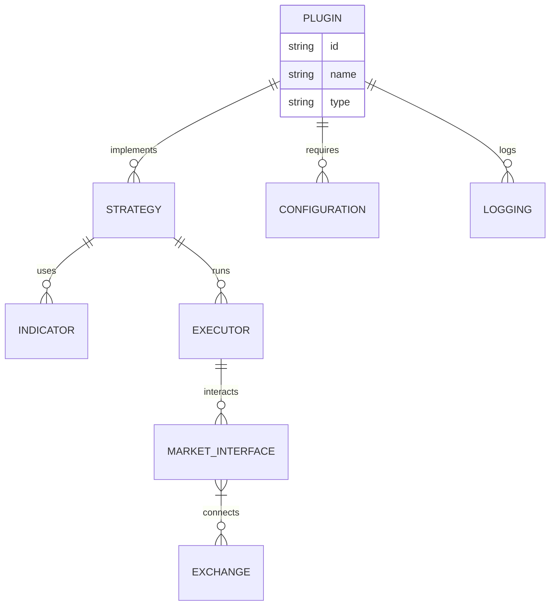

[](https://x.com/Quant-Trading_finance)
[](https://discord.com/invite/xPHTuHCmuV)
[](https://vscode.dev/redirect?url=vscode://ms-vscode-remote.remote-containers/cloneInVolume?url=https://github.com/Quant-Trading-finance/Quant-Trading)
<a href="https://codespaces.new/Quant-Trading-finance/Quant-Trading">
  
</a>
<a target="_blank" href="https://colab.research.google.com/github/Quant-Trading-finance/Quant-Trading/blob/develop/examples/googleColab.ipynb">
  
</a>


## Why Quant-Trading Plugins?
Most scripts inside this repository are technical indicator automated trading. These scripts include various types of momentum trading, opening range breakout, reversal of support & resistance and statistical arbitrage strategies. Yet, quantitative trading is not only about technical analysis. It can refer to computational finance to exploit derivative price mismatch, pattern recognition on alternative datasets to generate alphas or low latency order execution in the market microstructure. Hence, there are a few ongoing projects inside this repository. These projects are mostly quantamental analysis on some strange ideas I come up with to beat the market (or so I thought). There is no HFT strategy simply because ultra high frequency data are very expensive to acquire (even consider platforms like Quantopian or Quandl). Additionally, please note that, all scripts are historical data backtesting/forward testing (basically via Python, not C++, maybe Julia in the near future). The assumption is that all trades are frictionless. No slippage, no surcharge, no illiquidity. Last but not least, all scripts contain a global function named main so that you can embed the scripts directly into you trading system (although too lazy to write docstring).

<a>
  <div align="center">
  
  </div>
</a>


They are:
- 🔌 Modular & reusable components
- 📦 Environment-agnostic (backtest, sandbox, live)
- 🧩 Easy to plug into any strategy or workflow
- 🌐 Exchange-agnostic with unified interfaces

Create, share, or combine plugins for indicators, strategies, risk controls, and more — all while keeping your code clean and scalable.


## Quant-Trading Workspace

While the Quant-Trading Platform is all about an integration to dozens of different data vendors, the interface is either Python or a CLI.

If you want an enterprise UI to visualize this datasets and use AI agents on top, you can find Quant-Trading Workspace at.


### London Breakout

To one of my favourite cities in the world! Proud to be a Londoner!

London Breakout is an intra daily opening range breakout strategy. Basically, it is a fascinating information arbitrage across different markets in different time zones. FX market runs 24/7 globally. For instance, you cannot long the stock of Ford in ASX simply because Ford is listed in NYSE. As FX market is decentralised, you can long any currency pair in any market as long as the market is open. That leaves a door to take a peek at the activity in a closed foreign FX market before the opening of domestic FX market.

Back to London Breakout, London and Tokyo are two of the largest FX markets in the world. Tokyo FX trading hour is GMT 0:00 a.m. - GMT 8:59am. London FX trading hour (no summer daylight saving) begins at GMT 8:00 a.m. Even though there is an hour of overlap, the crucial timeframe of London Breakout is GMT 7:00 a.m. - GMT 7:59 a.m. a.k.a. the last trading hour before the opening of London market. The price movement of the crucial timeframe incorporates the information of all the overnight activities of financial market (from the perspective of the current time zone).

For the strategy itself, we establish upper and lower thresholds prior to the high and low of the crucial timeframe. Once London FX market opens, we spend the first couple of minutes to check if the price would breach the preset boundaries. If it is above threshold, we long the currency pair accordingly. Vice versa. Nevertheless, we should set up a limit to prevent us from trading in the case of abnormal opening volatility. Normally, we clear our positions based on our target stop loss or stop profit respectively. By the end of the trading hour (still from the perspective of the current time zone), if there are any open positions, we clear them out.


```python
import Quant-Trading
"""
This example shows how backtest over tweets
"""

class TwitterBot(Quant-Trading.Model):
    def main(self, args):
        while self.has_data:
            self.backtester.value_account()
            self.sleep('1h')

    def event(self, type_: str, data: str):
        # Now check if it's a tweet about Tesla
        if 'tsla' in data.lower() or 'gme' in data.lower():
            # Buy, sell or evaluate your portfolio
            pass


if __name__ == "__main__":
    exchange = Quant-Trading.Alpaca()
    model = TwitterBot(exchange)

    # Add the tweets json here
    model.backtester.add_custom_events(Quant-Trading.data.JsonEventReader('./tweets.json'))
    # Now add some underlying prices at 1 month
    model.backtester.add_prices('TSLA', '1h', start_date='3/20/22', stop_date='4/15/22')

    # Backtest or run live
    print(model.backtest(args=None, initial_values={'USD': 10000}))

```

## 🛠️ Installation

Follow the steps below to install and run this project on your local machine.

The Quant-Trading Platform can be installed as a [PyPI package](https://pypi.org/project/Quant-Trading/) by running `pip install Quant-Trading`

or by cloning the repository directly with `git clone https://github.com/Quant-Trading-finance/Quant-Trading.git`.

Please find more about the installation process, in the [Quant-Trading Documentation](https://docs.Quant-Trading.co/platform/installation).

### Quant-Trading Platform CLI installation

The Quant-Trading Platform CLI is a command-line interface that allows you to access the Quant-Trading Platform directly from your command line.

It can be installed by running `pip install Quant-Trading-cli`

or by cloning the repository directly with  `git clone https://github.com/Quant-Trading-finance/Quant-Trading.git`.

Please find more about the installation process in the

### 7. 🐳 Optional: Run with Docker

Build and run the plugin using Docker:

```bash
docker build -t Quant-Trading-rsi-plugin .
docker run -it --env-file .env Quant-Trading-rsi-plugin
```




<p align="center">
    
</p>

<p align="center">
  </center>
</p>

## Contributors

 wouldn't be  without you. If we are going to disrupt financial industry, every contribution counts. Thank you for being part of this journey.

<a href="https://github.com/Quant-Trading-finance/Quant-Trading/graphs/contributors">
   
</a>

#### AI Agent Marketplace Index And Router | [API Doc](https://www.deepnlp.org/doc/ai_agent_marketplace)
[](https://www.deepnlp.org/store/ai-agent/ai-agent/pub-Krexind/quant-trading-toolkit)

```
curl 'https://www.deepnlp.org/api/ai_agent_marketplace/v2?id=Krexind/quant-trading-toolkit'
```
    